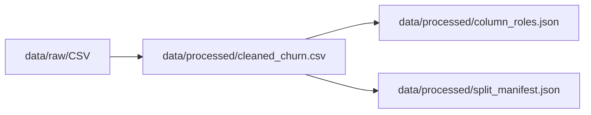

# Chapter 02 — Data Understanding & Cleaning

**Previous:** [Chapter 01](01_problem_and_business_context.md) | **Next:** [Chapter 03 — EDA & Insights](03_eda_and_insights.md)

---

## What You Will Learn

- Where the dataset comes from and what each column type means
- The difference between **raw**, **cleaned**, and **processed** data
- Why we made exactly **one** cleaning change (and nothing else)
- How features, target, and identifier columns are separated
- Why we do not modify the original raw CSV

---

## Dataset Overview

| Property | Value |
|----------|-------|
| **Source** | [Telco Customer Churn (Kaggle)](https://www.kaggle.com/datasets/blastchar/telco-customer-churn) |
| **Raw file** | `data/raw/WA_Fn-UseC_-Telco-Customer-Churn.csv` |
| **Rows** | 7,043 |
| **Columns** | 21 (including ID and target) |
| **Target** | `Churn`: Yes / No |
| **Churn rate** | ~26.5% Yes |

Each row is one customer snapshot: demographics, services subscribed, billing, tenure, and whether they churned.

---

## Beginner Box: Column Roles

| Role | Example | Used for modeling? |
|------|---------|-------------------|
| **Identifier** | `customerID` | No — only to link predictions back to customers |
| **Feature** | `tenure`, `Contract`, `MonthlyCharges` | Yes — model inputs |
| **Target** | `Churn` | No — this is what we predict (label) |

Rule from `AGENTS.md`: never use `customerID` as a predictive feature. It is a random-looking string with no generalizable signal.

---

## Raw vs Cleaned vs Processed



| Stage | Location | What happens |
|-------|----------|--------------|
| **Raw** | `data/raw/` | Original download — **never edited** |
| **Cleaned** | `data/processed/cleaned_churn.csv` | One deterministic fix applied |
| **Processed metadata** | `column_roles.json`, `split_manifest.json` | Schema and split indices |

---

## The Only Cleaning Change: TotalCharges

During EDA (Chapter 03), we found **11 rows** where `TotalCharges` was a blank string. All 11 had `tenure = 0` (brand-new customers who had not been billed yet).

**Fix:** Coerce to numeric; impute blank values to `0.0` for new customers.

Implementation: `src/data_cleaning.py`, function `_fix_total_charges()`:

```python
# Business logic: new customers (tenure=0) with blank TotalCharges → 0.0
# NOT learned imputation from other rows
```

### Why this is deterministic cleaning (not ML imputation)

- The blank values have a **clear business meaning** (no charges yet).
- We do not use median/mean from other customers — that would inject false signal.
- The fix is applied **before** any train/test split, so it is not leakage (same rule for everyone).

### Validation guards

`clean_churn_data()` enforces:

- No duplicate rows or duplicate `customerID`
- Row/column count unchanged
- Target distribution unchanged (no rows dropped)
- No missing values remain after cleaning

Run the pipeline:

```bash
python -c "from src.data_cleaning import run_cleaning_pipeline; run_cleaning_pipeline()"
```

---

## Feature / Target / ID Separation

After cleaning, notebook `03_feature_target_id_separation.ipynb` and `src/data_separation.py` split the data:

| Component | Count | Columns |
|-----------|-------|---------|
| **Numeric features** | 4 | `SeniorCitizen`, `tenure`, `MonthlyCharges`, `TotalCharges` |
| **Categorical features** | 15 | `gender`, `Partner`, `Contract`, `InternetService`, … |
| **Total features** | **19** | Excludes `customerID` and `Churn` |
| **Target** | 1 | `Churn` |
| **Identifier** | 1 | `customerID` |

Manifest saved to `data/processed/column_roles.json` for downstream reproducibility.

---

## Why Not Other Approaches?

| Alternative | Why we did not use it |
|-------------|----------------------|
| Edit the raw CSV in place | Violates reproducibility; raw must stay pristine |
| Drop the 11 `tenure=0` rows | Loses valid new-customer segment; only 11 rows |
| Median-impute `TotalCharges` | Wrong business meaning for new customers |
| Feature engineering now | Baseline-first discipline — use raw columns first, engineer only if needed |
| Use `customerID` as feature | No generalizable pattern; causes overfitting |
| Encode categoricals during separation | Encoding is a **learned** step — belongs in preprocessing (Chapter 06) |

---

## No Custom Feature Engineering (Yet)

We deliberately use the **19 cleaned raw columns** as features:

- No tenure bins
- No interaction terms (e.g., `MonthlyCharges / tenure`)
- No polynomial features

**Why?** Strong tree models (XGBoost) learn nonlinear patterns from raw columns. Adding engineered features without evidence of improvement adds complexity and leakage risk. EDA (next chapter) informs hypotheses; the model validates them.

---

## Code Map

| File | Key functions | Purpose |
|------|---------------|---------|
| `src/data_cleaning.py` | `run_cleaning_pipeline()`, `clean_churn_data()` | Raw → cleaned CSV |
| `src/data_separation.py` | `separate_features_target_id()`, `run_separation_pipeline()` | X / y / ID split + manifest |
| `src/data_loading.py` | `load_raw_churn_data()`, `load_cleaned_churn_data()` | Unified loaders for notebooks and apps |

---

## Hands-On

1. Run `notebooks/02_data_cleaning.ipynb` — inspect the 11-row audit table.
2. Run `notebooks/03_feature_target_id_separation.ipynb` — confirm 19 features.
3. Read `data/processed/column_roles.json` (after running pipelines).
4. Run tests: `pytest tests/test_data_cleaning.py tests/test_data_separation.py -v`

---

## Check Your Understanding

1. Why is imputing `TotalCharges` to 0.0 for `tenure=0` customers different from median imputation?
2. Why must `customerID` never appear in the feature matrix?
3. How many numeric vs categorical features does this project use?
4. Why do we save `column_roles.json` instead of hard-coding columns in every notebook?

---

**Next:** [Chapter 03 — EDA & Insights](03_eda_and_insights.md)
