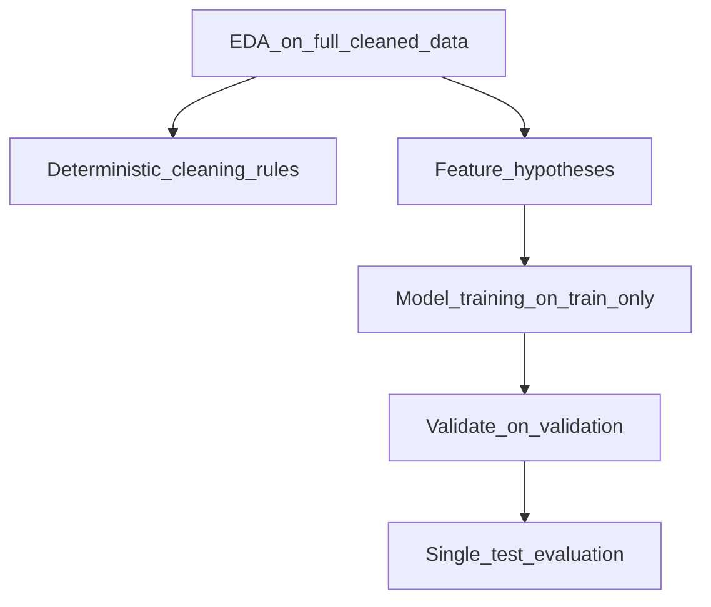

# Chapter 03 — EDA & Insights

**Previous:** [Chapter 02](02_data_understanding_and_cleaning.md) | **Next:** [Chapter 04 — Leakage & Data Hygiene](04_leakage_and_data_hygiene.md)

---

## What You Will Learn

- What **Exploratory Data Analysis (EDA)** is and what it is *not*
- Key patterns in the Telco churn dataset
- How EDA findings informed cleaning and modeling hypotheses
- Why EDA must not use the test set or drive test-set decisions

---

## What Is EDA?

**Exploratory Data Analysis** is the process of summarizing and visualizing data **before** building models. Goals:

- Understand distributions (how many churn vs not churn?)
- Spot data quality issues (missing values, wrong types)
- Form **hypotheses** about which features relate to churn
- Detect obvious problems (duplicates, impossible values)

EDA does **not** prove causation and does **not** replace proper model evaluation on held-out data.

---

## Beginner Box: What EDA Can and Cannot Tell You

| EDA can… | EDA cannot… |
|----------|-------------|
| Reveal imbalanced targets | Replace validation metrics |
| Show that month-to-month contracts churn more often | Prove that changing contract type *causes* less churn |
| Find blank `TotalCharges` values | Justify tuning on the test set |
| Guide cleaning rules | Guarantee model performance |

---

## Notebooks & Figures

| Notebook | Focus | Figures |
|----------|-------|---------|
| `01_eda.ipynb` | Broad overview: shape, types, missing values, churn rate | `reports/figures/01_*` – `03_*` |
| `04_focused_eda.ipynb` | Feature–churn relationships | `reports/figures/04_*` – `06_*` |

Figures are saved under `reports/figures/` when notebooks are executed locally.

---

## Key Findings

### 1. Class imbalance (~26.5% churn)

Roughly **1 in 4** customers churn. Not extremely rare, but imbalanced enough that accuracy alone misleads (see Chapter 01).

This drives later decisions: class weighting, PR-AUC as primary metric, threshold below 0.50.

### 2. Contract type strongly associated with churn

**Month-to-month** contracts show much higher churn rates than one- or two-year contracts. This becomes the **#1 SHAP feature** later (Chapter 13).

*Hypothesis:* Customers without long-term commitment are easier to leave.

### 3. Tenure matters

Newer customers (low `tenure`) churn more often. Long-tenure customers are stickier.

*Hypothesis:* Loyalty and switching costs increase over time.

### 4. MonthlyCharges and TotalCharges

Higher monthly bills correlate with churn in segments (especially with month-to-month contracts). `TotalCharges` partly reflects tenure × billing history.

### 5. OnlineSecurity and related services

Customers **without** online security (among fiber users) show higher churn in EDA cross-tabs. Service add-ons may indicate engagement.

### 6. TotalCharges data quality

11 blank strings, all `tenure = 0` → led directly to the cleaning rule in Chapter 02.

### 7. No duplicate rows; unique customerID

Validates that each row is one customer.

---

## Sentinel Categories

Several service columns use special values like `"No internet service"` or `"No phone service"` when a parent service is absent. These are **not missing data** — they carry meaning ("customer has no internet at all"). Preprocessing one-hot encodes them as regular categories (Chapter 06).

---

## How EDA Influenced the Project (Without Leakage)

| EDA finding | Downstream action |
|-------------|-------------------|
| Blank TotalCharges + tenure=0 | Deterministic imputation to 0.0 |
| ~26.5% churn rate | Stratified split; imbalance experiments |
| Contract / tenure patterns | Hypotheses confirmed by model + SHAP |
| No post-churn columns present | Leakage audit passes (Chapter 04) |
| Low-cardinality categoricals | OneHotEncoder (not target encoding) |

---

## Why Not Skip EDA?

| Alternative | Risk |
|-------------|------|
| Jump straight to XGBoost | Miss data bugs; waste time debugging models |
| Use test set for EDA | **Leakage** — test must stay untouched |
| Engineer many features from EDA | Overfit spurious patterns; add complexity early |

---

## EDA vs Modeling Boundaries

EDA on the **full cleaned dataset** is acceptable for **global** understanding and **fixed** cleaning rules. Anything **learned** from data (scaling, encoding, model weights, thresholds) must use **train only** (Chapters 04–06).

---

## Hands-On

1. Run `notebooks/01_eda.ipynb` — note churn rate and column dtypes.
2. Run `notebooks/04_focused_eda.ipynb` — compare churn rates by `Contract`.
3. Open any `reports/figures/04_*` or `05_*` PNG after running notebooks.
4. Write down three hypotheses you would expect the model to learn.

---

## Check Your Understanding

1. What is the approximate churn rate in this dataset?
2. Why does month-to-month contract status matter for retention strategy?
3. Why is EDA on the full dataset OK for finding blank `TotalCharges`, but not OK for choosing a threshold?
4. What is the difference between a pattern in a chart and a causal claim?

---

**Next:** [Chapter 04 — Leakage & Data Hygiene](04_leakage_and_data_hygiene.md)
