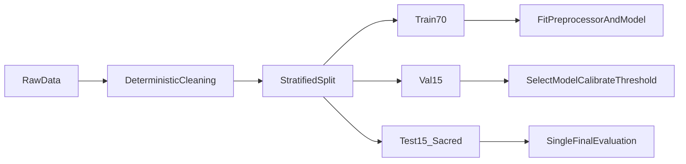

# Chapter 04 — Leakage & Data Hygiene

**Previous:** [Chapter 03](03_eda_and_insights.md) | **Next:** [Chapter 05 — Train/Val/Test Split](05_train_val_test_split.md)

---

## What You Will Learn

- What **data leakage** is and why it ruins ML projects
- The roles of **train**, **validation**, and **test** sets
- Specific leakage checks performed in this project
- Rules that apply to preprocessing, resampling, and tuning

---

## What Is Data Leakage?

**Data leakage** occurs when information from **outside the training set** influences model training or selection, making offline metrics look better than real-world performance.

Common examples:

- Scaling features using the **full dataset** (test statistics leak into train)
- Applying **SMOTE before splitting** (synthetic examples copy test-like patterns)
- Using **post-churn information** as features (e.g., cancellation date)
- Tuning hyperparameters on the **test set**

Leakage is often silent — you only discover it when the model fails in production.

---

## Beginner Box: Train vs Validation vs Test

| Set | Fraction | Purpose | Used for fitting? |
|-----|----------|---------|-------------------|
| **Train** | 70% | Learn model weights & preprocessing | Yes |
| **Validation** | 15% | Compare models, tune threshold, pick calibration | No (only evaluate) |
| **Test** | 15% | **Final** honest evaluation — once | No |

Think of it like studying for an exam:

- **Train** = practice problems you learn from
- **Validation** = practice exam (adjust study strategy)
- **Test** = final exam — open **once**, no retakes

> **Sacred test set:** Never use the test set for hyperparameter tuning, feature selection, threshold selection, model selection, or calibration decisions. See `AGENTS.md` Rule 3.

---

## Leakage Audit (Notebook 05)

`notebooks/05_leakage_audit.ipynb` documents systematic checks:

### 1. No future / post-churn columns

Forbidden examples (not in this dataset, but checked conceptually):

- Cancellation date
- Termination reason
- Final invoice amount after leaving
- Post-churn account status

All 19 features are knowable **at prediction time** for an active customer.

### 2. customerID excluded from features

`customerID` is a unique identifier — it would let the model memorize individuals, not generalize. Kept only for linking predictions (`src/data_separation.py`).

### 3. Target not in features

`Churn` must never appear in `X`. Obvious but enforced by validation.

### 4. Learned transforms fit on train only

| Transform | Fit on | Apply to val/test |
|-----------|--------|-------------------|
| Median imputation | Train | Transform only |
| StandardScaler | Train | Transform only |
| OneHotEncoder categories | Train | Transform only |
| SMOTE / undersampling | Train (when used) | Never |
| XGBoost trees | Train | Predict only |
| Calibration (Platt) | Train (CV folds) | Predict only |

Implementation: `src/preprocessing.py` — `fit_preprocessor()` uses `X_train` only.

---

## Leakage Flow Diagram

---

## SMOTE and Resampling Rules

When we experiment with SMOTENC (Chapter 09):

- Applied **after** split
- Applied **inside** training pipeline only
- **Never** on validation or test rows

Applying SMOTE before split would create synthetic training points influenced by validation/test distribution — classic leakage.

---

## Why Not Other Approaches?

| Alternative | Leakage risk |
|-------------|--------------|
| Fit scaler on full dataset | Test mean/std leak into training |
| Target encoding on full data | Uses target labels from val/test |
| Tune threshold on test set | Threshold overfit to test noise |
| Use test set for "final" model comparison repeatedly | Each peek is a tuning iteration |
| Cross-validate on test | Test is no longer unbiased |

---

## Hygiene Checklist (Project Rules)

From `AGENTS.md`:

1. Raw CSV never modified
2. Preprocessing in sklearn `Pipeline` / `ColumnTransformer`
3. Same pipeline for training and inference
4. Probabilities, not just hard labels
5. No fabricated metrics — all from actual runs

---

## Hands-On

1. Run `notebooks/05_leakage_audit.ipynb`.
2. Read `src/preprocessing.py` — find `fit_preprocessor()` and confirm it only receives `X_train`.
3. Run `pytest tests/test_preprocessing.py -v` — tests include "fit on train only" checks.

---

## Check Your Understanding

1. Give one example of data leakage in preprocessing.
2. What is the validation set used for in this project?
3. Why must SMOTE never be applied before the train/test split?
4. Can you use the test set to check if your model "looks good" mid-project?

---

**Next:** [Chapter 05 — Train/Val/Test Split](05_train_val_test_split.md)
