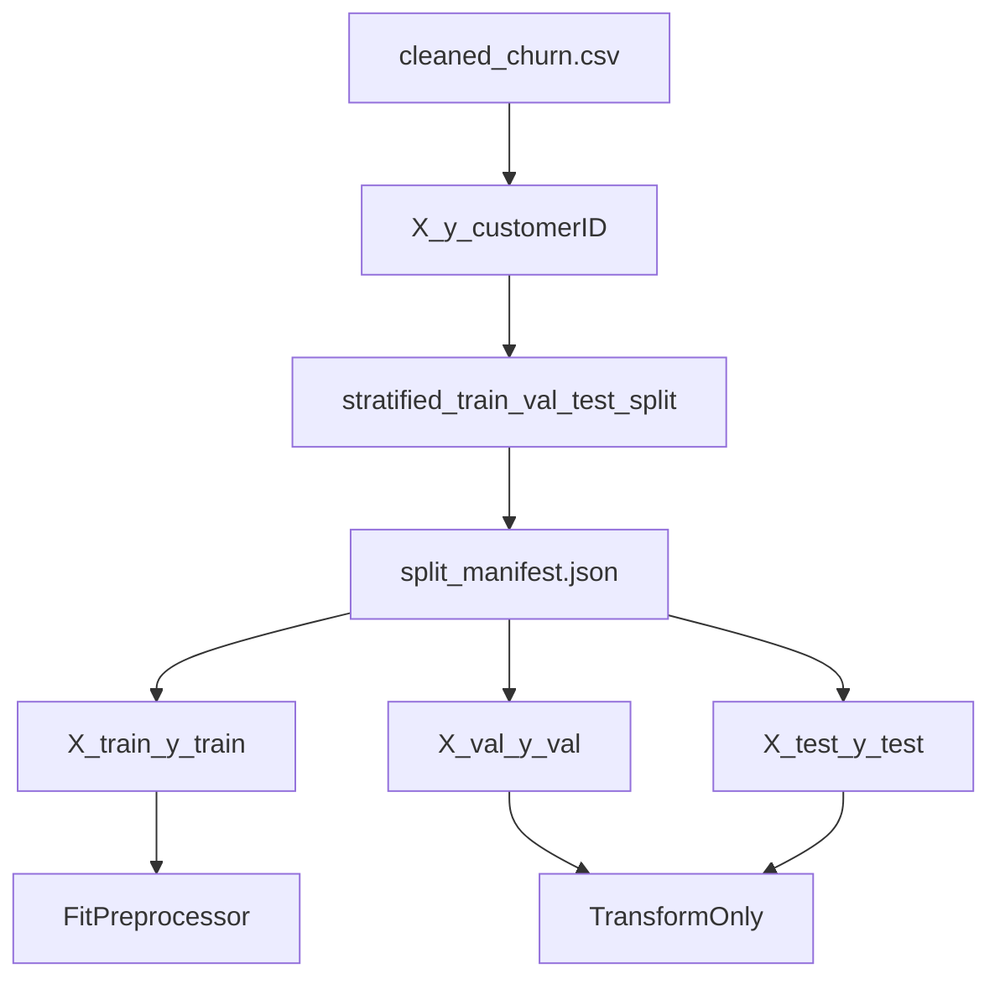

# Chapter 05 — Train/Val/Test Split

**Previous:** [Chapter 04](04_leakage_and_data_hygiene.md) | **Next:** [Chapter 06 — Preprocessing & Pipelines](06_preprocessing_and_pipelines.md)

---

## What You Will Learn

- How a **stratified 70/15/15** split works
- Why we use a **two-stage** split
- What `split_manifest.json` stores and why
- How to reproduce the exact same partitions every time

---

## Split Summary

| Partition | Share | Rows | Purpose |
|-----------|-------|------|---------|
| **Train** | 70% | 4,930 | Fit preprocessing, model, calibration |
| **Validation** | 15% | 1,056 | Model selection, calibration choice, threshold tuning |
| **Test** | 15% | 1,057 | **Single final evaluation** (Chapter 16) |

Churn rate (~26.5%) is preserved in each partition via **stratified sampling**.

---

## Beginner Box: Stratified Split & random_state

**Stratified sampling** keeps the same proportion of churners (Yes/No) in each split. Without it, random luck might put 30% churn in validation and 22% in train — making comparisons unfair.

**random_state=42** fixes the random number generator seed so the **same split** is reproduced every run. Reproducibility matters for debugging, tests, and portfolio review.

---

## Two-Stage Split Logic

Implemented in `src/data_split.py`, function `stratified_train_val_test_split()`:

**Stage 1:** Split 70% train vs 30% temporary holdout (stratified on `Churn`)

**Stage 2:** Split holdout 50/50 into validation (15%) and test (15%) — also stratified

```python
RANDOM_STATE = 42
TRAIN_SIZE = 0.70
HOLDOUT_SIZE = 0.30
VAL_TEST_RATIO = 0.50  # 30% * 50% = 15% each
```

Uses `sklearn.model_selection.train_test_split` with `stratify=y`.

---

## Split Manifest

Instead of saving three separate CSV files, we save **row indices** to:

`data/processed/split_manifest.json`

Benefits:

- Single source of truth for which rows belong where
- No duplicate copies of feature data
- Tests and notebooks reload identical partitions via `load_split_from_manifest()`

The manifest also records metadata: random seed, sizes, churn counts per split.

---

## Validation Checks

`run_split_pipeline()` validates:

- No overlapping indices between train, val, test
- Expected row counts (4930 / 1056 / 1057)
- Churn rate stable across splits (max spread ≤ 0.10 percentage points)
- All 19 feature columns present in each partition

Run:

```bash
python -c "from src.data_split import run_split_pipeline; run_split_pipeline()"
```

---

## Sacred Test Set (Reminder)

> The test set (1,057 rows) is used **once** in `notebooks/17_final_test_evaluation.ipynb` after the model, calibration method, and threshold **0.10** are frozen.

If test metrics disappoint, the correct response is document and investigate — **not** retune on test and re-evaluate.

---

## Why Not Other Split Strategies?

| Alternative | Why not used |
|-------------|--------------|
| Random split without stratification | Could skew churn rate per partition |
| 80/10/10 | Valid, but 15% val/test gives ~1k rows each — stable metric estimates |
| Time-based split | Dataset has no transaction timestamp / cohort date |
| K-fold only (no holdout) | Need one completely untouched test for final report |
| Split after preprocessing | Preprocessing must fit on train — split comes first |
| Single 50/50 split | Too little training data for ~5k-row effective train |

---

## Data Flow After Split



---

## Code Map

| File | Key symbols |
|------|-------------|
| `src/data_split.py` | `SplitData`, `stratified_train_val_test_split()`, `run_split_pipeline()` |
| `src/data_loading.py` | `load_train_val_split()` |
| `notebooks/06_data_split.ipynb` | Interactive split exploration |

---

## Hands-On

1. Run `notebooks/06_data_split.ipynb`.
2. Inspect `data/processed/split_manifest.json` — verify train/val/test counts.
3. Run `pytest tests/test_data_split.py -v`.

---

## Check Your Understanding

1. Why do we stratify on the target column?
2. How does the two-stage split produce 70/15/15 from one dataset?
3. What is stored in `split_manifest.json` and why not three CSVs?
4. When is the test set allowed to be used?

---

**Next:** [Chapter 06 — Preprocessing & Pipelines](06_preprocessing_and_pipelines.md)
