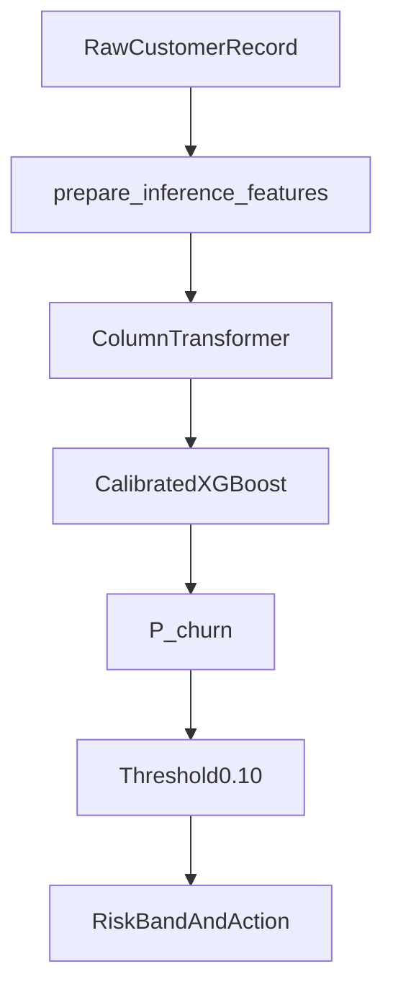

# Chapter 14 — Production Engineering

**Previous:** [Chapter 13](13_shap_explainability.md) | **Next:** [Chapter 15 — Streamlit, FastAPI & Tests](15_streamlit_fastapi_and_tests.md)

---

## What You Will Learn

- Why notebooks were refactored into `src/`
- The **`ChurnModelBundle`** artifact structure
- How training, saving, and loading work
- The end-to-end inference flow

---

## Notebooks vs `src/`

| Layer | Purpose |
|-------|---------|
| **`notebooks/`** | Exploration, visualization, decision documentation |
| **`src/`** | Reusable, testable production logic |

Rule from `AGENTS.md`: **no duplicated preprocessing** between notebooks, Streamlit, FastAPI, and training scripts.

---

## Architecture Overview



---

## `src/` Module Map

| Module | Responsibility |
|--------|----------------|
| [`config.py`](../src/config.py) | Paths, frozen hyperparameters, cost defaults, JSON loaders |
| [`data_cleaning.py`](../src/data_cleaning.py) | Raw → cleaned CSV pipeline |
| [`data_separation.py`](../src/data_separation.py) | X / y / customerID split, column roles |
| [`data_split.py`](../src/data_split.py) | Stratified 70/15/15 split, manifest |
| [`data_loading.py`](../src/data_loading.py) | Unified loaders for notebooks and apps |
| [`preprocessing.py`](../src/preprocessing.py) | ColumnTransformer, fit/transform |
| [`model.py`](../src/model.py) | Train, calibrate, save/load bundle |
| [`inference.py`](../src/inference.py) | Single/batch prediction, API response builder |
| [`policy.py`](../src/policy.py) | Threshold decision, risk bands, service normalization |
| [`evaluation.py`](../src/evaluation.py) | Metrics, threshold sweep, business cost |

---

## ChurnModelBundle

Defined in `src/model.py`:

```python
@dataclass(frozen=True)
class ChurnModelBundle:
    preprocessor: ColumnTransformer
    model: CalibratedClassifierCV
    threshold: float
    metadata: dict
```

Everything needed for inference travels in **one object**.

---

## Saved Artifacts

| File | Contents |
|------|----------|
| `models/churn_pipeline.joblib` | Primary `ChurnModelBundle` (preprocessor + model + threshold) |
| `models/model_config.json` | Deployment metadata for apps (model name, threshold, validation metrics) |
| `reports/chosen_threshold.json` | Frozen threshold 0.10 + validation metrics at that threshold |

Train and save:

```bash
python -c "from src.model import run_training_pipeline; run_training_pipeline()"
```

Load:

```python
from src.model import load_churn_pipeline
bundle = load_churn_pipeline()
```

---

## Training Pipeline (What Happens)

`run_training_pipeline()` in `src/model.py`:

1. Load split from `split_manifest.json`
2. `compute_scale_pos_weight(y_train)` → ~2.77
3. `build_preprocessor()` → fit on **X_train only**
4. `build_calibrated_model()` → XGBoost + sigmoid CV=5
5. Fit on transformed training data
6. Attach frozen threshold from `chosen_threshold.json`
7. Save bundle + write `model_config.json`

**Validation and test are never fit.**

---

## Inference Pipeline (What Happens)

`src/inference.py` key functions:

| Function | Role |
|----------|------|
| `prepare_inference_features()` | Validate one raw record (19 features) |
| `predict_churn_probability()` | Transform + `predict_proba` positive class |
| `predict_single_customer()` | End-to-end single score |
| `predict_batch()` | Batch scoring with optional IDs |
| `build_churn_prediction_response()` | Full dict for API (prob, label, risk, action) |

`TotalCharges` blank allowed only when `tenure=0` — mirrors cleaning rules.

---

## Why joblib?

- Native sklearn/XGBoost serialization
- Single file artifact easy to version and deploy
- Loaded once at API/Streamlit startup (cached)

---

## Why Not Other Architectures?

| Alternative | Why not |
|-------------|---------|
| Retrain on every API call | Absurd latency and cost |
| Separate preprocessors per app | Drift and bugs |
| ONNX-only export | sklearn pipeline sufficient for portfolio |
| Microservice per model component | Over-engineered for one tabular model |
| Store raw predictions only | Lose reproducible feature pipeline |

---

## Hands-On

1. Trace `run_training_pipeline()` in `src/model.py` line by line.
2. Load bundle in Python and score one validation row.
3. Compare `bundle.threshold` to `reports/chosen_threshold.json`.

---

## Check Your Understanding

1. What four objects live inside `ChurnModelBundle`?
2. Why is the preprocessor saved with the model?
3. Which partition is used to fit the preprocessor?
4. Why move logic from notebooks to `src/`?

---

**Next:** [Chapter 15 — Streamlit, FastAPI & Tests](15_streamlit_fastapi_and_tests.md)
