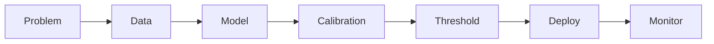

# Chapter 16 — Monitoring & Limitations

**Previous:** [Chapter 15](15_streamlit_fastapi_and_tests.md) | **Next:** [Glossary](17_glossary_and_further_reading.md)

---

## What You Will Learn

- Final **test set** results and how to interpret them
- A production **monitoring plan** (documented, not coded)
- Honest **limitations** of this portfolio project
- What you would do next in a real company

---

## Final Test Evaluation

Notebook: `17_final_test_evaluation.ipynb`  
Artifact: `reports/final_test_metrics.json`

The test set (1,057 rows, 15%) was evaluated **once** after freezing:

- XGBoost + class weighting
- Sigmoid calibration
- Threshold **0.10**

> **Sacred test set:** These results did **not** trigger retuning.

### Test vs Validation

| Metric | Test | Validation |
|--------|------|------------|
| Accuracy | 0.641 | 0.633 |
| Precision | 0.419 | 0.415 |
| Recall | 0.908 | 0.946 |
| F1 | 0.574 | 0.577 |
| ROC-AUC | 0.833 | 0.845 |
| PR-AUC | 0.659 | 0.645 |
| Brier score | 0.140 | 0.136 |
| Predicted churners | 608 | 638 |

Metrics are **broadly aligned**. Test recall is slightly lower (more FN: 26 vs 15); PR-AUC marginally higher on test. Gaps fit sampling noise on ~1k-row holdouts — not evidence to retune.

### Test Confusion Matrix (threshold = 0.10)

|  | Predicted No | Predicted Churn |
|--|--------------|-----------------|
| **Actual No** | 423 (TN) | 353 (FP) |
| **Actual Yes** | 26 (FN) | 255 (TP) |

**Simulated test cost:** $30,650 (= 353×$50 + 26×$500)

---

## Monitoring Plan

Documented in README — **no runtime monitoring code** in this repo. In production you would track:

| Signal | What to monitor | Action threshold |
|--------|-----------------|------------------|
| **Feature drift** | PSI / KS vs training baselines on `tenure`, `Contract`, `MonthlyCharges`, service flags | Alert if PSI > 0.2 |
| **Score drift** | Mean/median P(churn), fraction above 0.10 | Alert on >2σ week-over-week shift |
| **Churn-rate drift** | Realized churn vs ~26.5% training prior | Investigate market changes |
| **Calibration drift** | Rolling Brier, PR-AUC, precision/recall at 0.10 | Quarterly review; retrain via governed lifecycle |

**Recommended log fields per prediction:**

- timestamp, `customerID`, features hash, probability, threshold, decision, model version

---

## Beginner Box: What Is Drift?

**Drift** means production data or model behavior changes over time. Example: if every customer suddenly has fiber internet, the model trained on older mixes may degrade. Monitoring detects this before revenue impact.

---

## Limitations (Honest Assessment)

| Limitation | Implication |
|------------|-------------|
| **Static snapshot** | No time column; model may not generalize to future market shifts |
| **Simulated costs** | $50/$500 not validated against real campaign ROI |
| **High recall policy** | Threshold 0.10 → many FP contacts (~58% of flagged customers are false alarms on test) |
| **SHAP on uncalibrated trees** | Explanations approximate calibrated decisions |
| **Risk bands ≥ 0.50** | UI escalation only — not separately validated |
| **No A/B test** | Cannot claim causal retention lift |
| **No CI/CD or Docker** | Portfolio scope stops at tests + docs |
| **Gitignored artifacts** | Models/data must be reproduced locally |

---

## Why Not Claim More?

| Temptation | Why avoided |
|------------|-------------|
| "Model saves $X million" | Needs real cost data and experiments |
| Retune after seeing test | Invalidates unbiased evaluation |
| Deploy without monitoring plan | Production ML requires drift awareness |
| Add deep learning for buzz | No evidence of gain on 7k tabular rows |

---

## Real-World Next Steps

1. **Shadow mode** — log predictions without acting; compare to outcomes
2. **Pilot campaign** — A/B test retention offers on model-selected vs control group
3. **Refresh data** — retrain quarterly with new labeled cohorts
4. **Calibrate costs** — finance validates FP/FN dollar values
5. **Implement drift jobs** — PSI dashboards, alert runbooks

---

## Project Lifecycle Complete

All 22 steps from `AGENTS.md` are represented in notebooks, `src/`, apps, tests, and this guide.

---

## Hands-On

1. Run `notebooks/17_final_test_evaluation.ipynb`.
2. Read `reports/final_test_metrics.json` in full.
3. Write a one-paragraph "executive summary" using test metrics only.
4. List three monitoring alerts you would configure in production.

---

## Check Your Understanding

1. Why were test metrics not used to change threshold 0.10?
2. What is feature drift and why monitor `Contract` distribution?
3. What fraction of test "Churn" predictions were false positives?
4. Name two limitations that require business validation beyond ML metrics.

---

**Next:** [Glossary & Further Reading](17_glossary_and_further_reading.md)
